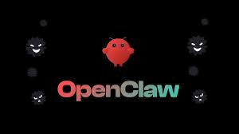

# 🎓 OpenClaw E-Learning Task Reminder



Sistem pengelolaan tugas E-Learning yang cerdas dengan integrasi notifikasi otomatis ke **Telegram Bot**. Dirancang khusus untuk mempermudah **Dosen** memberikan tugas dan **Mahasiswa** memantau deadline secara tepat waktu.

---

## 🚀 Fitur Utama
- **Role-Based Portal**: Dashboard yang berbeda untuk Dosen dan Mahasiswa.
- **Dynamic Meeting Grid**: 16 Pertemuan per mata kuliah dengan manajemen tugas per pertemuan.
- **Instant Notification**: Notifikasi Telegram langsung terkirim begitu Dosen menekan tombol "Upload Tugas".
- **Intelligent Reminders**: Pengingat otomatis pada **H-3, H-2, H-1, dan H0 (hari deadline)** via OpenClaw Engine.
- **Duplicate Prevention**: Sistem `notification_log` untuk menjamin tidak ada pesan ganda yang masuk ke grup Telegram.

---

## 🛠️ Tech Stack
- **Frontend**: React + Vite + TailwindCSS + React Router.
- **Backend API**: Node.js + Express.js.
- **Database**: PostgreSQL (Neon Serverless).
- **Automation Service**: OpenClaw (Node.js Scheduler).
- **Notification**: Telegram Bot API.

---

## 📂 Struktur Folder
```
Reminder/
├── backend-node/      # Express API Server (Port 5000)
├── frontend/          # React Dashboard UI (Port 5173)
├── openclaw/          # Automation & Scheduler Engine
├── .env               # Konfigurasi Token & DB URL (Global)
└── .gitignore         # File pengecualian Git
```

---

## ⚙️ Cara Menjalankan Project

### 1. Persiapan Environment
Pastikan file `.env` di folder root sudah terisi dengan benar:
```env
DATABASE_URL=postgres://... (Link Neon DB)
TELEGRAM_BOT_TOKEN=... (Token dari @BotFather)
TELEGRAM_CHANNEL_ID=... (ID Group/Channel Telegram)
```

### 2. Jalankan Backend (API Server)
Terminal 1:
```bash
cd backend-node
npm install
npm run start
```
*Server akan berjalan di http://localhost:5000*

### 3. Jalankan Frontend (Dashboard Web)
Terminal 2:
```bash
cd frontend
npm install
npm run dev
```
*Buka browser di http://localhost:5173*

### 4. Jalankan OpenClaw (Scheduler Reminder)
Terminal 3:
```bash
cd openclaw
npm install
npm start
```
*Engine ini akan memantau deadline database setiap jam.*

---

## 🧪 Cara Pengujian
1. **Login Dosen**: Gunakan nama `Bapak Dosen` dan password `password`.
2. **Pilih Matkul**: Klik kotak "Jaringan Komputer".
3. **Pilih Pertemuan**: Masuk ke "Pertemuan 2".
4. **Upload Tugas**: Isi form tugas.
   - Cek Telegram: Notifikasi **"Tugas Baru Diberikan"** harus muncul secara instan!
5. **Login Mahasiswa**: Gunakan nama `Mahasiswa Budi` dan password `password`.
   - Cek Dashboard: Angka "Tugas Mendekati Deadline" akan terupdate otomatis jika deadline h-3.
   - Cek Pertemuan 2: Tugas yang dibuat Dosen tadi akan muncul di sini.

---

## 📝 Licence
Created with 💙 by Antigravity Assistant.
